# System Architecture Document
## FastestJSONInTheWest - High-Performance C++23 JSON Library

### Document Information
- **Version**: 1.0
- **Date**: November 14, 2025
- **Status**: Draft
- **Authors**: Olumuyiwa Oluwasanmi

---

## 1. Architecture Overview

FastestJSONInTheWest follows a modular, layered architecture designed for maximum performance, maintainability, and scalability. The system is built using modern C++23 modules and follows a clean separation of concerns.

### 1.1 High-Level Architecture

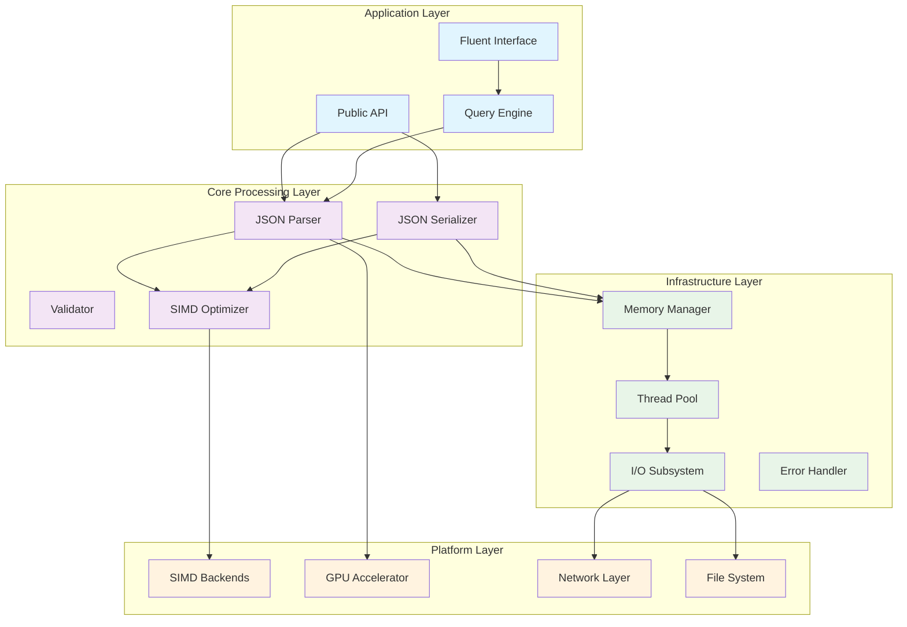

### 1.2 Module Structure

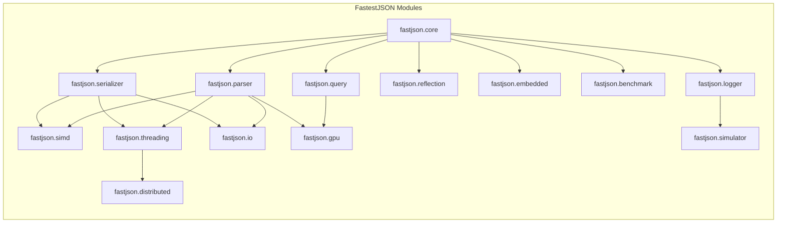

---

## 2. Core Components

### 2.1 JSON Parser Architecture

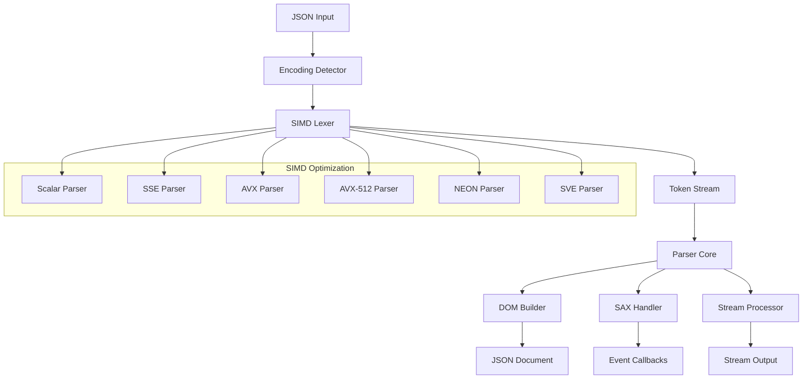

### 2.2 Memory Management Architecture

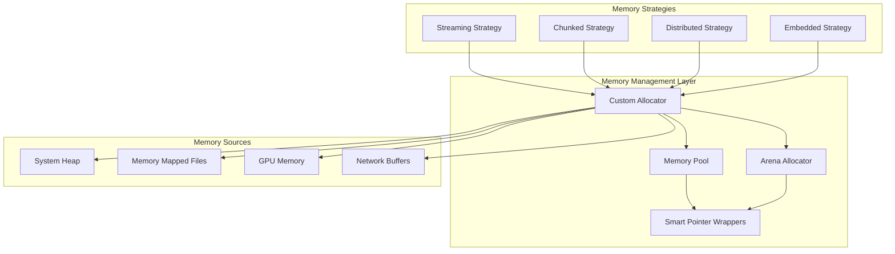

### 2.3 Threading Architecture

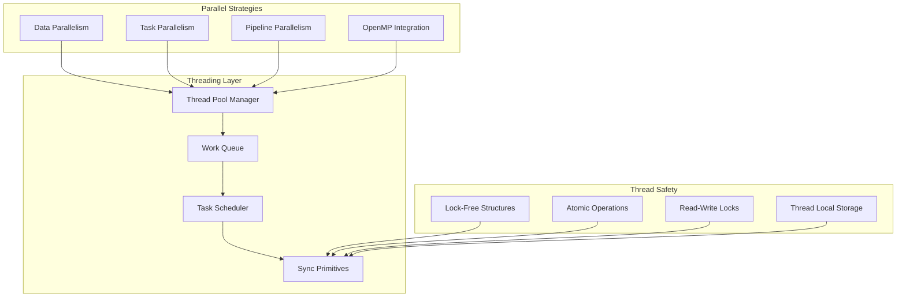

---

## 3. Data Flow Architecture

### 3.1 Parsing Data Flow

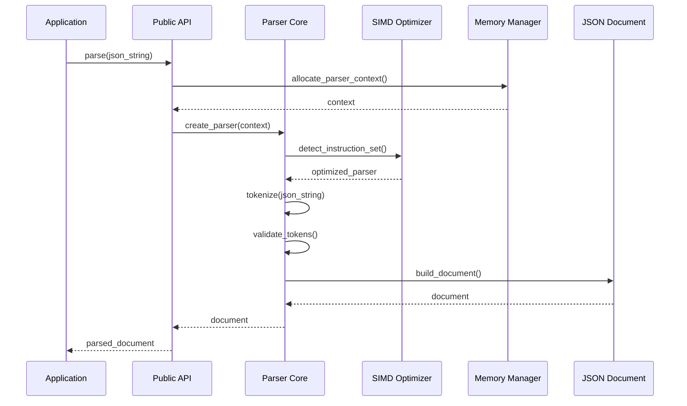

### 3.2 Serialization Data Flow

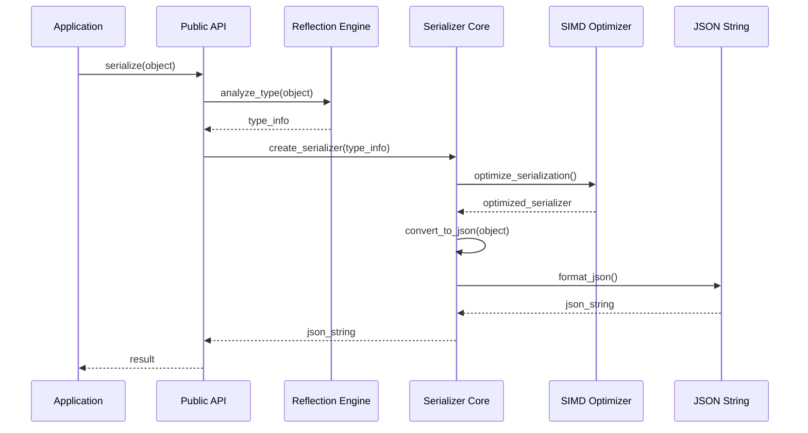

### 3.3 Query Processing Data Flow

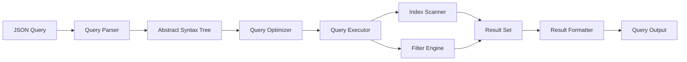

---

## 4. Component Interactions

### 4.1 Core Component Relationships

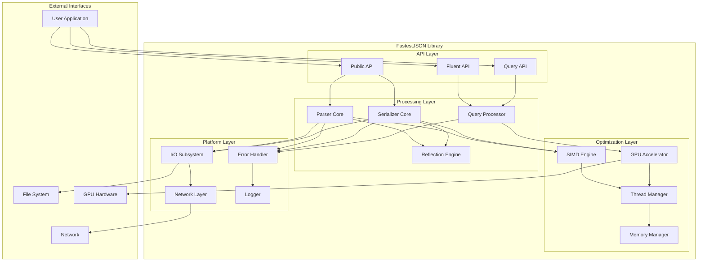

### 4.2 Logger and Simulator Integration

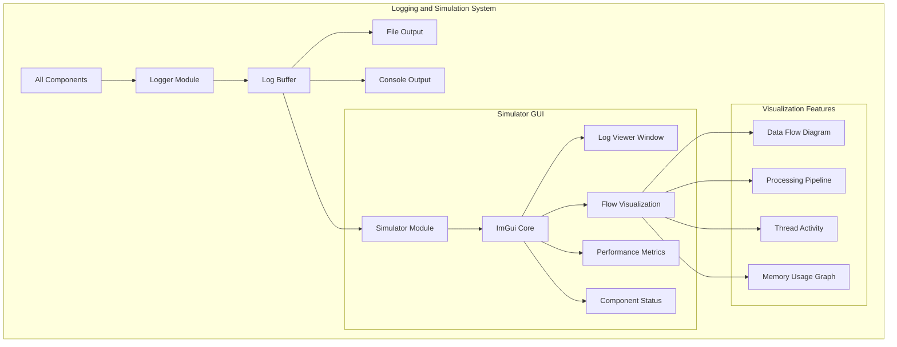

---

## 5. Scalability Architecture

### 5.1 Single Machine Scaling

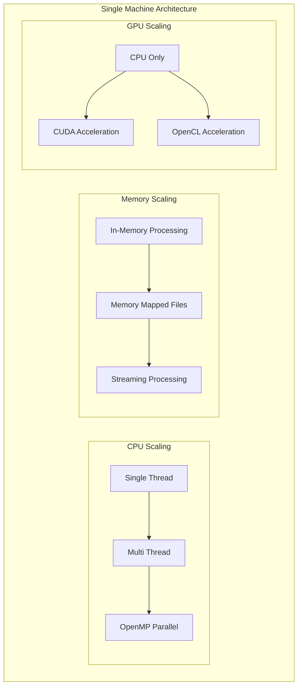

### 5.2 Distributed Scaling

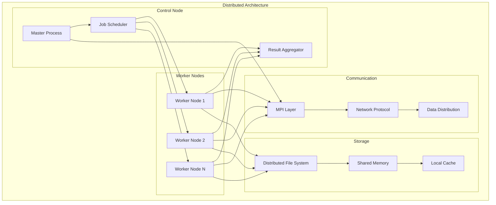

---

## 6. Error Handling Architecture

### 6.1 Error Handling Strategy

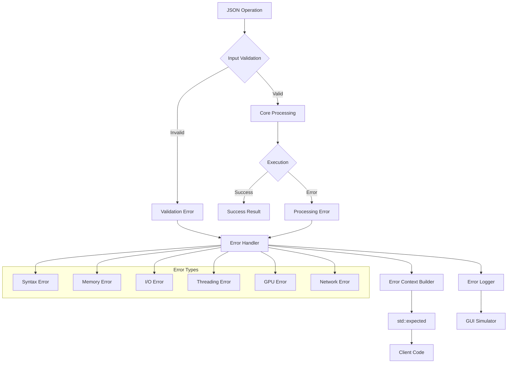

---

## 7. Performance Architecture

### 7.1 SIMD Optimization Strategy

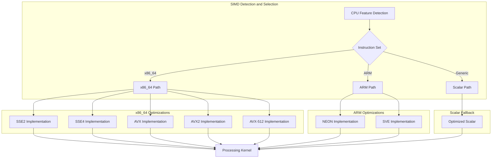

### 7.2 Memory Performance Strategy

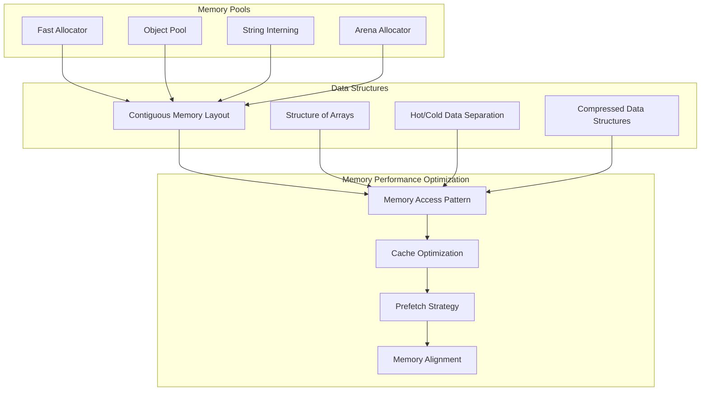

---

## 8. Security Architecture

### 8.1 Security Measures

```mermaid
graph TB
    subgraph "Input Security"
        InputValidation[Input Validation]
        BoundsChecking[Bounds Checking]
        BufferOverflowProtection[Buffer Overflow Protection]
        EncodingValidation[Encoding Validation]
    end
    
    subgraph "Memory Security"
        SmartPointers[Smart Pointers Only]
        RAIIManagement[RAII Management]
        StackProtection[Stack Protection]
        HeapProtection[Heap Protection]
    end
    
    subgraph "Runtime Security"
        SanitizersSupport[Sanitizers Support]
        StaticAnalysis[Static Analysis]
        FuzzTesting[Fuzz Testing]
        MemoryLeakDetection[Memory Leak Detection]
    end
    
    InputValidation --> BoundsChecking
    BoundsChecking --> BufferOverflowProtection
    BufferOverflowProtection --> EncodingValidation
    
    SmartPointers --> RAIIManagement
    RAIIManagement --> StackProtection
    StackProtection --> HeapProtection
    
    SanitizersSupport --> StaticAnalysis
    StaticAnalysis --> FuzzTesting
    FuzzTesting --> MemoryLeakDetection
```

---

## 9. Deployment Architecture

### 9.1 Build and Distribution

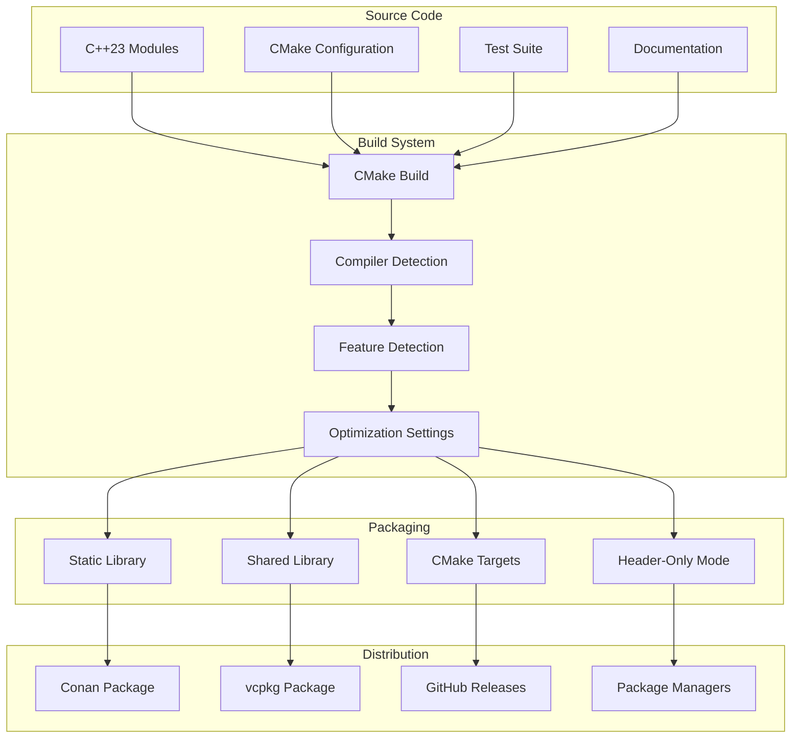

---

## 10. Quality Assurance Architecture

### 10.1 Testing Strategy

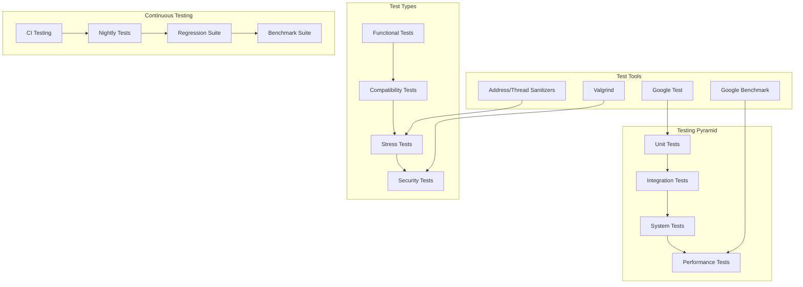

This architecture document provides a comprehensive view of the FastestJSONInTheWest library structure, ensuring scalability, maintainability, and performance while adhering to modern C++23 standards and best practices.