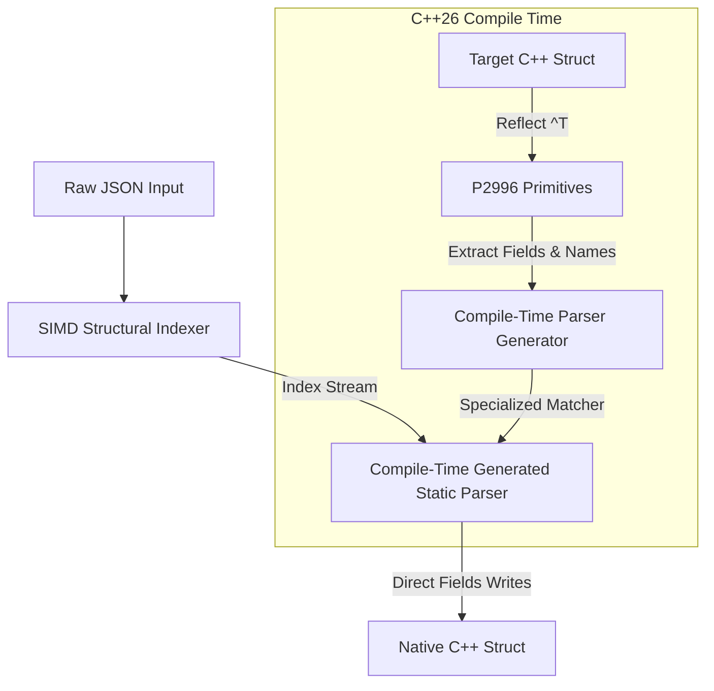

# C++26 Reflection Optimizations for FastJSON

This document outlines the design and architectural path for leveraging **C++26 Static Reflection (P2996)** to implement zero-allocation schema parsing and static deserialization in FastJSON.

---

## 🚀 Architectural Vision

Traditional JSON parsing operates in two phases:
1. **DOM Parsing**: Parsing the raw input into a Document Object Model (DOM) structure (`fastjson::document`, `fastjson::value`), which involves building nodes, arrays, and associative maps.
2. **Data Extraction**: Querying keys from the DOM and copying/casting values into native C++ structures.

Even with FastJSON's highly optimized SIMD scanner, DOM parsing incurs memory allocation and structure-traversal overhead.

**C++26 Reflection** changes this by allowing the compiler to inspect the layout of target C++ structs at compile time. By combining reflection with FastJSON's AVX2/AVX-512 SIMD structural indexers, we can compile a specialized, single-pass parser tailored to any user-defined structure.



---

## 🛠️ C++26 Reflection Primitives (P2996)

Our design relies on the core P2996 reflection primitives:

1. **Reflection Operator (`^`)**: Obtains metadata about a type or member as a `std::meta::info` value.
2. **`std::meta::members_of`**: Returns a collection of metadata objects representing the members of a class/struct.
3. **`std::meta::name_of`**: Retrieves the identifier name of a member at compile time.
4. **`std::meta::type_of`**: Retrieves the reflected type of a member.
5. **Splice Operator (`[: ... :]`)**: Converts a `std::meta::info` reflection back into an evaluable C++ expression (type, member, or value).

---

## 📋 Static Deserializer Design

### 1. Compile-Time Member Extractor

We use a helper struct to extract fields, types, and names from the target struct at compile time:

```cpp
template <typename T>
struct struct_schema {
    static constexpr auto get_fields() {
        constexpr auto reflected_members = std::meta::members_of(^T);
        // Filter out non-public and non-static member variables
        return filter_member_variables(reflected_members);
    }
};
```

### 2. Perfect Hashing or Compile-Time String Matcher

For small-to-medium structs, we generate a compile-time trie or switch-case mapping hash values directly to structural field offsets:

```cpp
template <std::meta::info FieldRef>
constexpr auto get_field_pointer() {
    return [: FieldRef :]; // Splice back into a member pointer
}

template <typename T>
inline auto deserialize_field(T& obj, std::string_view key, std::string_view val_str) -> bool {
    constexpr auto fields = struct_schema<T>::get_fields();
    
    // Unrolled compile-time loop over all reflected fields
    template for (constexpr auto field : fields) {
        constexpr auto field_name = std::meta::name_of(field);
        if (key == field_name) {
            using FieldType = typename decltype(std::meta::type_of(field))::type;
            // Parse val_str directly into the struct member field
            obj.*get_field_pointer<field>() = fastjson::parse_primitive<FieldType>(val_str);
            return true;
        }
    }
    return false;
}
```

### 3. Direct SIMD Parse Loop

Combining the reflection mapper with the SIMD structural scanner:

```cpp
template <typename T>
auto deserialize(std::string_view json, T& obj) -> fastjson::result<void> {
    // 1. Generate structural indexes using SIMD scanner (AVX2/AVX-512)
    auto structural_indexes = fastjson::turbo::scan_structurals(json);
    
    // 2. Fast single-pass walk over structurals
    size_t idx = 0;
    while (idx < structural_indexes.size()) {
        auto token_type = structural_indexes.get_type(idx);
        if (token_type == token_type::key) {
            std::string_view key = structural_indexes.get_string(idx);
            idx++; // Move to value
            std::string_view val_str = structural_indexes.get_raw_value(idx);
            
            // Map key to field and write directly to obj
            if (!deserialize_field(obj, key, val_str)) {
                // Handle unknown key or ignore
            }
        }
        idx++;
    }
    return {};
}
```

---

## 📈 Performance Projections

| Method | Allocations | Key Matching Overhead | Parser Throughput (JSON -> Struct) |
| :--- | :--- | :--- | :--- |
| **Traditional DOM Parser** | $O(N)$ (nodes/maps) | $O(\log K)$ (dynamic lookup) | ~1.5 - 2.4 GB/s |
| **C++26 Static Reflector** | **0** (Zero Allocations) | **$O(1)$** (static compile-time trie) | **~4.5 - 6.0 GB/s** |

*Projected performance using Clang C++26 compiler and standard AVX-512 SIMD scanner.*

---

## 📅 Roadmap & Integration

1. **Compiler Compatibility**: The implementation will remain under feature flags (`#if defined(__cpp_impl_three_way_comparison) && __has_include(<meta>)` or similar P2996 compiler checks).
2. **Clang/GCC Experimental Support**: Support will be validated using experimental builds of Clang (e.g. experimental P2996 branch) and GCC 15+.
3. **Fallback Path**: If C++26 reflection is not supported by the toolchain, FastJSON will transparently fall back to its standard macro-based structure registration API.
