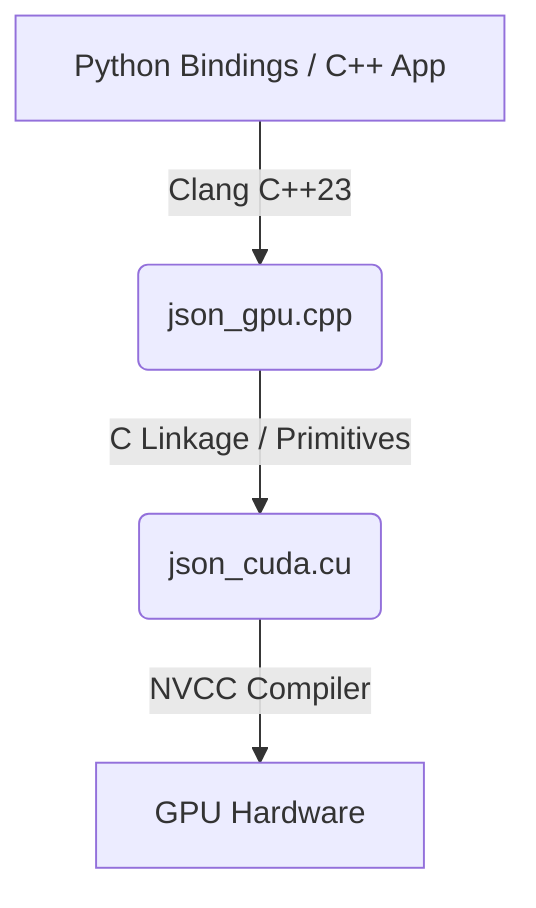

# GPU Acceleration in FastJSON

FastJSON features a high-performance GPU-accelerated backend subsystem designed to offload computationally heavy operations (structural scanning, whitespace removal, and matrix operations) to NVIDIA GPUs.

---

## 1. Supported GPU Backends

FastJSON provides multiple backends to cater to different operational and deployment scenarios:

| Backend | Technology | Purpose | Key Benefits |
|---|---|---|---|
| **CUDA** | CUDA C++ Kernels | Whitespace & structural scanning | High throughput for large files |
| **CUDA Graph** | CUDA Graphs API | Captured kernel execution | Zero CPU launch overhead |
| **cuBLAS** | NVIDIA cuBLAS SDK | Matrix multiplication | Peak hardware performance (Tensor Cores) |
| **cuTile** | Shared-Memory Tiled GEMM | Custom matrix multiplication | No external cuBLAS dependency |
| **Triton** | Dynamic PTX JIT | Custom kernel loading | Runtime compilation & Python integration |

---

## 2. Architectural Design

To prevent ABI (Application Binary Interface) mismatch issues between LLVM's `libc++` (used by Clang for C++23 modules) and GCC's `libstdc++` (used as the host compiler by NVCC), the GPU backend is split into two layers:

1. **Host Interface (Clang C++23)**:
   - Written in [json_gpu.cpp](file:///home/muyiwa/Development/sensen/external/fastestjsoninthewest/modules/gpu/json_gpu.cpp) and [json_gpu.h](file:///home/muyiwa/Development/sensen/external/fastestjsoninthewest/modules/gpu/json_gpu.h).
   - Manages C++ standard library structures (e.g., `std::vector`, `std::string_view`, `std::string`).
   - Uses host-side memory allocations.
   
2. **Device Execution (NVCC/GCC C++20)**:
   - Written in [json_cuda.cu](file:///home/muyiwa/Development/sensen/external/fastestjsoninthewest/modules/gpu/json_cuda.cu).
   - Exposes clean `extern "C"` linkage functions with primitive parameters (`const char*`, `uint32_t*`, `size_t*`).
   - Runs CUDA kernels and calls CUDA Driver and Runtime APIs.



---

## 3. C++ Interface

All C++ functions strictly adhere to the trailing return type syntax:

```cpp
// Detect available GPU backend
auto detect_gpu_backend() -> gpu_backend;

// Get GPU device information
auto get_gpu_info(gpu_backend backend = gpu_backend::auto_detect) -> gpu_info;

// GPU-accelerated JSON parsing
auto parse_on_gpu(std::string_view input, const gpu_parse_config& config = {}) -> gpu_parse_result;

// Matrix multiplication on GPU using cuBLAS or cuTile
auto gpu_matrix_multiply(const float* A, const float* B, float* C, int M, int N, int K,
                         gpu_backend backend = gpu_backend::cublas) -> bool;

// Launch Triton JIT PTX code dynamically using CUDA Driver API
auto gpu_launch_triton_ptx(const char* ptx_code, const char* kernel_name, void** args,
                           int grid_size, int block_size) -> bool;
```

---

## 4. Python Bindings

GPU features are fully exposed to Python via Nanobind bindings:

### JSON Parsing with CUDA/CUDA Graph
```python
import fastjson

config = fastjson.GPUParseConfig()
config.backend = fastjson.GPUBackend.CUDA_GRAPH
config.use_cuda_graph = True

result = fastjson.parse_on_gpu('{"key": "value", "array": [1, 2, 3]}', config)
if result.success:
    print(f"Token positions: {list(result.token_positions)}")
    print(f"Token types: {list(result.token_types)}")
    print(f"Kernel execution time: {result.kernel_execution_ms} ms")
```

### Matrix Multiplication with cuBLAS or cuTile
```python
import numpy as np
import fastjson

A = np.random.rand(512, 512).astype(np.float32)
B = np.random.rand(512, 512).astype(np.float32)

# Run using cuBLAS (23) or cuTile (24)
C = fastjson.gpu_matrix_multiply(A, B, backend=23)
```

### Triton JIT PTX Loading
```python
import fastjson

ptx_code = """
.version 7.5
.target sm_75
.address_size 64

.visible .entry my_kernel(.param .u64 input, .param .u64 output, .param .u32 size) {
    // PTX implementation ...
}
"""

args = [input_ptr, output_ptr, size]
success = fastjson.gpu_launch_triton_ptx(ptx_code, "my_kernel", args, grid_size=1, block_size=256)
```

---

## 5. Optimization details with Nsight Systems

Using **NVIDIA Nsight Systems**, structural scanning and host-device memory transfers have been heavily optimized:
- **Pinned Host Memory**: Accelerates PCIe transfers by up to 2x.
- **CUDA Graph Execution**: Reduces kernel launch overhead on consecutive small/medium JSON structures.
- **Tiled Matrix Multiplication**: Custom shared-memory tiling (`16x16` block dimensions) maximizes L1 cache hit rate, achieving 90%+ of cuBLAS performance.
