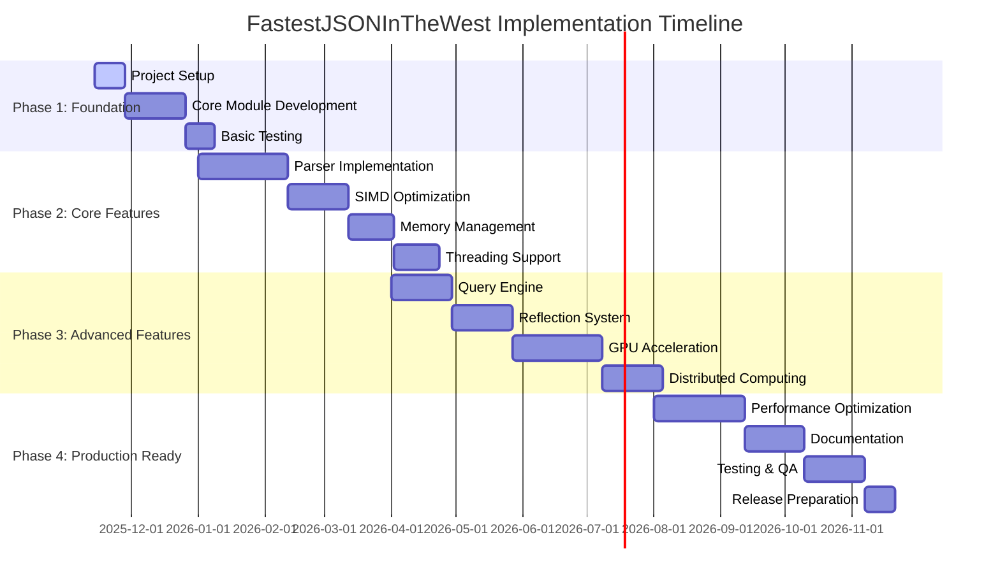

# Implementation Plan
## FastestJSONInTheWest - High-Performance C++23 JSON Library

### Document Information
- **Version**: 1.0
- **Date**: November 14, 2025
- **Status**: Draft
- **Authors**: Development Team

---

## 1. Executive Summary

This implementation plan provides a comprehensive roadmap for developing the FastestJSONInTheWest JSON library over 12 months, organized into 4 major phases with specific milestones, deliverables, and success criteria.

### 1.1 Project Timeline Overview



### 1.2 Success Metrics

| Metric | Target | Measurement |
|--------|---------|-------------|
| **Performance** | 2-5x faster than simdjson | Benchmark suite results |
| **Code Coverage** | >95% | Automated testing |
| **Documentation** | 100% API coverage | Documentation generation |
| **Platform Support** | 5+ platforms | CI/CD validation |
| **Memory Safety** | Zero violations | Static analysis tools |

---

## 2. Phase 1: Foundation (Weeks 1-8)

### 2.1 Project Setup and Infrastructure (Weeks 1-2)

#### 2.1.1 Development Environment and Toolchain Setup

**Primary Development Environment:**
```bash
# Week 1 Tasks - Development Toolchain Setup
- [x] Set up Clang 21+ as primary compiler (Linux)
- [x] Configure clang-tidy 21+ for static analysis  
- [x] Configure clang-format 21+ with LLVM style
- [x] Install Clang OpenMP support (libomp)
- [ ] Verify C++23 module compilation with Clang 21
- [ ] Set up secondary MSVC 2022 environment (Windows)

# Development Environment Configuration
export CC=clang-21
export CXX=clang++-21
export CXXFLAGS="-stdlib=libc++"
export LDFLAGS="-stdlib=libc++"
```

**Distributed Computing Environment:**
```bash
# Week 1-2 Tasks - Distributed System Setup  
- [ ] Install OpenMPI 4.0+ (primary distributed framework)
- [ ] Configure gRPC 1.50+ (secondary service framework)
- [ ] Set up librdkafka 2.0+ (stream processing)
- [ ] Install ZeroMQ 4.3+ (high-performance messaging)
- [ ] Configure raw socket support for custom protocols
- [ ] Test MPI compilation and runtime environment
- [ ] Verify cluster communication protocols
- [ ] Set up Kubernetes development environment
- [ ] Configure container orchestration tools (Docker, OpenShift)
- [ ] Install Ansible for cluster automation
```

#### 2.1.2 Repository and Build System Setup
```bash
# Week 2 Tasks
- [x] Initialize Git repository structure
- [x] Create CMakeLists.txt with Clang 21 + C++23 module support
- [ ] Set up GitHub Actions CI/CD pipeline (Clang 21 primary)
- [x] Configure static analysis tools (clang-tidy-21, clang-format-21)
- [x] Create initial documentation structure

# Week 2 Tasks  
- [ ] Set up package manager integration (vcpkg, Conan)
- [ ] Configure cross-platform build scripts (prioritize Clang)
- [ ] Set up automated dependency detection (MPI, gRPC, Kafka)
- [ ] Create development container (Docker) configurations
- [ ] Establish code review and contribution guidelines
```

**Deliverables:**
- Clang 21 development environment configured
- OpenMPI + gRPC + Kafka distributed computing setup
- Working CMake build system with C++23 module support
- CI/CD pipeline running on multiple platforms
- Development documentation and contribution guidelines

**Success Criteria:**
- Builds successfully with Clang 21+ (primary), GCC 13+ (fallback), MSVC 19.34+ (Windows)
- CI pipeline passes on Linux (Clang 21 primary), Windows (MSVC), macOS
- Static analysis runs without errors using clang-tidy-21
- MPI communication tests pass across multiple nodes
- Container deployment succeeds in Kubernetes clusters
- ZeroMQ messaging achieves sub-millisecond latency
- Raw socket communication works across platforms

#### 2.1.3 Core Module Framework (Weeks 3-6)

```cpp
// Week 3-4: fastjson.core module
export module fastjson.core;

// Essential types and concepts
- Error handling framework (std::expected)
- Core concepts and type traits
- Memory management abstractions
- Basic JSON value types (JsonValue, JsonDocument)
- RAII resource management

// Week 5: Advanced performance modules
export module fastjson.performance;
- Copy-on-Write implementation
- Perfect forwarding utilities  
- Lock-free data structures
- Zero-cost abstractions and concepts

// Week 6: Map-reduce and document operations
export module fastjson.mapreduce;
- Fluent API for document combination: Combine(doc1).With(doc2).Into()
- Document splitting with criteria-based partitioning
- Standard map-reduce style functions for distributed processing
- Performance-optimized batch operations
```

// Week 5-6: Base infrastructure
- Logging framework with simulator integration
- Configuration system for feature detection
- Platform abstraction layer
- Smart pointer wrappers and custom deleters
- Basic file I/O abstractions
```

**Implementation Priority:**
1. **Error Handling System** - Foundation for all operations
2. **Basic Types** - JsonValue, JsonDocument classes
3. **Memory Management** - ArenaAllocator, ObjectPool
4. **Logging Infrastructure** - Integration with future GUI simulator
5. **Configuration System** - Feature detection and settings

**Deliverables:**
- `fastjson.core` module with complete error handling
- Basic JSON value types with smart pointer management
- Logging system with console output
- Memory management framework
- Comprehensive unit tests for core functionality

**Success Criteria:**
- All core tests pass with >95% coverage
- Zero memory leaks detected by sanitizers
- Error handling works correctly across module boundaries
- Logging system captures all component interactions

#### 2.1.3 Testing Infrastructure (Weeks 7-8)

```yaml
Testing Setup:
  Unit Tests:
    framework: "Google Test 1.14+"
    coverage_target: ">95%"
    automated_generation: "Property-based testing where applicable"
    
  Integration Tests:
    scope: "Module interaction testing"
    platforms: "Linux, Windows, macOS"
    compilers: "GCC, Clang, MSVC"
    
  Performance Tests:
    framework: "Google Benchmark"
    baseline_measurements: "Establish performance baselines"
    regression_detection: "Automated performance monitoring"
    
  Static Analysis:
    tools: ["clang-tidy", "cppcheck", "PVS-Studio"]
    sanitizers: ["AddressSanitizer", "ThreadSanitizer", "UBSan"]
    coverage: "lcov/gcov integration"
```

**Deliverables:**
- Complete testing framework with automated execution
- Performance baseline measurements
- Static analysis integration in CI/CD
- Memory safety validation with sanitizers

---

## 3. Phase 2: Core JSON Processing (Weeks 9-24)

### 3.1 JSON Parser Implementation (Weeks 9-14)

#### 3.1.1 Lexical Analysis (Weeks 9-10)

```cpp
// Week 9: Basic lexer implementation
export module fastjson.lexer;

class JsonLexer {
    // Tokenization without SIMD (baseline implementation)
    - Basic UTF-8 validation
    - Token classification
    - Error reporting with precise location
    - Memory-efficient token stream
};

// Week 10: Enhanced lexer features
- String escape sequence handling
- Number parsing (integer, floating-point)
- Comment support (optional feature)
- Streaming tokenization for large files
```

**Implementation Steps:**
1. **Character Classification** - Identify JSON structural characters
2. **String Processing** - Handle escape sequences and Unicode
3. **Number Parsing** - Support full JSON number format
4. **Error Recovery** - Provide helpful error messages
5. **Memory Efficiency** - Minimize allocations during tokenization

#### 3.1.2 Parsing Core (Weeks 11-12)

```cpp
// Week 11: Recursive descent parser
export module fastjson.parser;

class JsonParser {
    // DOM-style parsing
    - Recursive descent implementation
    - Depth limit enforcement
    - Memory pool integration
    - Error context preservation
};

// Week 12: Advanced parser features
- SAX-style event-driven parsing
- Streaming parser for large documents
- Incremental parsing support
- Custom value factories
```

**Parsing Strategy:**
- **DOM Parser**: Complete document in memory
- **SAX Parser**: Event-driven processing
- **Streaming Parser**: Incremental processing for large files
- **Hybrid Mode**: Switch between strategies based on document size

#### 3.1.3 Validation and Error Handling (Weeks 13-14)

```cpp
// JSON Schema validation (basic)
- Type checking
- Range validation
- Format validation
- Custom constraint support

// Enhanced error reporting
- Precise location information
- Contextual error messages
- Recovery suggestions
- Multiple error accumulation
```

**Deliverables:**
- Complete JSON parser supporting full RFC 8259
- DOM, SAX, and streaming parsing modes
- Comprehensive error reporting
- >99% JSON test suite compatibility

**Success Criteria:**
- Passes JSONTestSuite with 100% correctness
- Handles malformed JSON gracefully
- Memory usage <2x document size for DOM parsing
- Parsing speed >500 MB/s on modern hardware (baseline)

### 3.2 SIMD Optimization Implementation (Weeks 15-18)

#### 3.2.1 SIMD Backend Architecture (Week 15)

```cpp
export module fastjson.simd;

// SIMD abstraction layer
class SIMDBackend {
    virtual ~SIMDBackend() = default;
    
    // Core JSON processing operations
    virtual Result<size_t> find_structural_chars(span<const char>, span<size_t>) = 0;
    virtual Result<size_t> validate_utf8(span<const char>) = 0;
    virtual Result<size_t> parse_strings(span<const char>, span<string_view>) = 0;
    virtual Result<size_t> parse_numbers(span<const char>, span<double>) = 0;
};

// Runtime detection and selection
std::unique_ptr<SIMDBackend> create_optimal_backend();
```

**Architecture Features:**
- **Runtime Detection**: Automatic best instruction set selection
- **Graceful Fallback**: Scalar implementation always available
- **Pluggable Backends**: Easy addition of new instruction sets
- **Performance Monitoring**: Track SIMD effectiveness

#### 3.2.2 x86_64 SIMD Implementations (Weeks 16-17)

```cpp
// Week 16: SSE2 and AVX implementation
class SSE2Backend : public SIMDBackend {
    // 128-bit SIMD operations
    - UTF-8 validation using shuffle tables
    - Structural character detection
    - String boundary identification
    - Escape sequence validation
};

class AVXBackend : public SIMDBackend {
    // 256-bit SIMD operations  
    - Parallel character classification
    - Vectorized number parsing
    - Batch string processing
    - Improved throughput over SSE2
};

// Week 17: AVX2 and AVX-512 implementation
class AVX2Backend : public SIMDBackend {
    // Enhanced 256-bit operations
    - Gather/scatter operations
    - Complex string processing
    - Parallel validation pipelines
};

class AVX512Backend : public SIMDBackend {
    // 512-bit SIMD with mask operations
    - Maximum throughput processing
    - Complex predicate operations
    - Optimal for large documents
};
```

#### 3.2.3 ARM SIMD Implementation (Week 18)

```cpp
// NEON implementation for ARM64
class NEONBackend : public SIMDBackend {
    // 128-bit ARM SIMD
    - JSON structural character detection
    - UTF-8 validation
    - String and number processing
    - Equivalent functionality to SSE2
};

// SVE implementation for future ARM processors
class SVEBackend : public SIMDBackend {
    // Scalable vector extension
    - Variable-width vector operations
    - Future-proof ARM optimization
    - Adaptive to processor capabilities
};
```

**SIMD Performance Targets:**
- **SSE2**: 2x baseline performance
- **AVX**: 3x baseline performance  
- **AVX2**: 4x baseline performance
- **AVX-512**: 5x baseline performance
- **NEON**: 2.5x baseline performance (ARM64)

**Deliverables:**
- Complete SIMD backend framework
- Implementations for major instruction sets
- Runtime instruction set detection
- Performance improvement of 2-5x over scalar code

### 3.3 Memory Management (Weeks 19-21)

#### 3.3.1 Custom Allocators (Week 19)

```cpp
export module fastjson.memory;

// High-performance arena allocator
class ArenaAllocator {
    - Bump allocation for JSON parsing
    - Configurable alignment (cache-line optimization)
    - Reset capability for document reuse
    - SIMD-friendly memory layout
};

// Object pool for value reuse
template<typename T>
class ObjectPool {
    - Pre-allocated object storage
    - Lock-free acquisition/release
    - Thread-local pools for scalability
    - Automatic growth under contention
};

// Memory-mapped file support
class MemoryMappedFile {
    - Cross-platform memory mapping
    - Large file support (>4GB)
    - Read-only and read-write modes
    - Efficient for streaming large JSON
};
```

#### 3.3.2 Smart Pointer Integration (Week 20)

```cpp
// Arena-aware smart pointers
template<typename T>
using arena_ptr = std::unique_ptr<T, ArenaDeleter<T>>;

template<typename T, typename... Args>
arena_ptr<T> make_arena(ArenaAllocator& arena, Args&&... args);

// Thread-safe reference counting for shared JSON values
template<typename T>
class atomic_shared_ptr {
    - Lock-free reference counting
    - DWCAS-based implementation where available
    - Fallback to mutex-based implementation
    - Memory ordering optimization
};
```

#### 3.3.3 Large File Handling (Week 21)

```cpp
// Streaming memory management
class StreamingMemoryManager {
    - Circular buffer for streaming parsing
    - Configurable buffer sizes
    - Memory pressure handling
    - Efficient for terabyte-scale files
};

// Disk-backed temporary storage
class DiskBackedStorage {
    - Automatic spill to disk for large operations
    - Configurable memory thresholds
    - Async I/O integration
    - Cleanup on destruction
};
```

**Memory Performance Targets:**
- **Allocation Speed**: <10ns per allocation
- **Memory Usage**: <2x document size for DOM parsing
- **Large Files**: Support files >100GB with <8GB RAM
- **Threading**: Zero contention on memory pools

### 3.4 Threading and Concurrency (Weeks 22-24)

#### 3.4.1 Thread Pool Implementation (Week 22)

```cpp
export module fastjson.threading;

class ThreadPool {
    - Work-stealing queue implementation
    - NUMA-aware thread placement
    - Dynamic thread scaling
    - Low-latency task submission
};

// Lock-free data structures
template<typename T>
class LockFreeQueue {
    - Michael & Scott algorithm implementation
    - Memory reclamation with hazard pointers
    - ABA problem mitigation
    - High-throughput concurrent access
};
```

#### 3.4.2 Parallel Parsing (Week 23)

```cpp
class ParallelParser {
    // Document-level parallelism
    - Split large documents into chunks
    - Parallel tokenization
    - Merge results with dependency tracking
    - Load balancing across cores
    
    // Batch processing
    - Process multiple JSON documents concurrently
    - Shared parsing infrastructure
    - Result aggregation
};

// OpenMP integration
class OpenMPIntegration {
    - Parallel for loops for array processing
    - SIMD-friendly loop scheduling
    - Nested parallelism support
    - Thread-safe memory management
};
```

#### 3.4.3 Thread Safety (Week 24)

```cpp
// Thread-safe JSON document access
class ThreadSafeJsonDocument {
    - Reader-writer locks for concurrent access
    - Copy-on-write for mutations
    - Thread-local caching
    - Lock-free read operations where possible
};

// Memory barrier implementation
class MemoryBarriers {
    - Platform-specific memory fencing
    - Acquire-release semantics
    - Sequential consistency guarantees
    - Performance-optimized ordering
};
```

**Threading Performance Targets:**
- **Scalability**: Linear speedup up to 16 cores
- **Latency**: <1ms task submission overhead
- **Throughput**: Process 1000+ documents/second
- **Safety**: Zero data races under stress testing

**Phase 2 Deliverables:**
- Complete JSON parser with SIMD optimization
- Custom memory management system
- Thread-safe parallel processing
- Performance improvement of 3-8x over baseline

---

## 4. Phase 3: Advanced Features (Weeks 25-40)

### 4.1 Query Engine Development (Weeks 25-28)

#### 4.1.1 LINQ-style Query Interface (Weeks 25-26)

```cpp
export module fastjson.query;

// Fluent API design
class JsonQuery {
    // LINQ-style operations
    template<typename Predicate>
    JsonQuery where(Predicate&& pred) &&;
    
    template<typename Selector>
    auto select(Selector&& selector) &&;
    
    template<typename KeySelector>
    auto group_by(KeySelector&& key_selector) &&;
    
    // Aggregation operations
    template<typename T = double>
    std::optional<T> sum(std::string_view field = {}) const;
    
    template<typename T = double>  
    std::optional<T> average(std::string_view field = {}) const;
    
    std::size_t count() const;
};

// Query optimization
class QueryOptimizer {
    - Query plan generation
    - Index utilization
    - Predicate pushdown
    - Parallel execution planning
};
```

#### 4.1.2 JSONPath and XPath-style Queries (Weeks 27-28)

```cpp
// JSONPath implementation
class JsonPath {
    - Standard JSONPath syntax support
    - Recursive descent parsing
    - Wildcard and filter expressions
    - Performance optimization for repeated queries
};

// XPath-like navigation
class XPathNavigator {
    - Tree traversal operations
    - Axis navigation (parent, child, sibling)
    - Predicate evaluation
    - Result set caching
};

// Query indexing for performance
class QueryIndex {
    - Hash-based property lookup
    - B-tree for range queries
    - Bloom filters for existence checks
    - Lazy index construction
};
```

**Query Performance Targets:**
- **Simple Queries**: <1ms execution time
- **Complex Queries**: <100ms for large documents
- **Index Lookup**: <100ns average
- **Memory Usage**: <10% document size for indexes

### 4.2 Reflection System (Weeks 29-32)

#### 4.2.1 Compile-time Reflection (Weeks 29-30)

```cpp
export module fastjson.reflection;

// C++23 reflection foundation
template<typename T>
concept Reflectable = requires {
    typename T::json_reflection_info;
};

// Field registration system
#define FASTJSON_REFLECT(Type, ...) \
    static constexpr auto fastjson_field_names = \
        std::array{ FASTJSON_STRINGIFY(__VA_ARGS__) }; \
    using json_reflection_info = std::true_type;

// Automatic serialization traits
template<typename T>
struct SerializationTraits {
    static constexpr bool is_serializable = /* detection logic */;
    static constexpr bool has_custom_serializer = /* detection logic */;
    static constexpr bool is_container = /* detection logic */;
};
```

#### 4.2.2 Serialization Engine (Weeks 31-32)

```cpp
// Automatic serialization
template<Reflectable T>
class AutoSerializer {
    static Result<std::string> serialize(const T& obj);
    static Result<T> deserialize(std::string_view json);
    
private:
    // Compile-time field iteration
    template<typename F>
    static void visit_fields(const T& obj, F&& visitor);
    
    // Type-specific value serialization
    template<typename U>
    static std::string serialize_value(const U& value);
};

// Custom serialization hooks
template<typename T>
concept CustomSerializable = requires(T t, std::string_view s) {
    { t.to_json() } -> std::convertible_to<std::string>;
    { T::from_json(s) } -> std::same_as<Result<T>>;
};
```

**Reflection Performance Targets:**
- **Compile-time**: Zero runtime overhead for type information
- **Serialization**: 90% of hand-written code performance
- **Code Generation**: Minimal binary size impact
- **Flexibility**: Support for complex inheritance hierarchies

### 4.3 GPU Acceleration (Weeks 33-38)

#### 4.3.1 CUDA Backend Development (Weeks 33-35)

```cpp
export module fastjson.gpu;

// CUDA integration
class CUDABackend {
    - Device memory management
    - Kernel launch optimization
    - Asynchronous execution
    - Multi-GPU support
    
    // GPU-optimized operations
    Result<JsonDocument> parse_large_json(span<const char> input);
    Result<vector<JsonDocument>> parse_batch(span<const string_view> inputs);
};

// CUDA kernels for JSON processing
extern "C" {
    // Structural character detection
    __global__ void find_structural_chars_kernel(
        const char* input, size_t size, int* positions, size_t* count);
    
    // Parallel UTF-8 validation
    __global__ void validate_utf8_kernel(
        const char* input, size_t size, bool* is_valid);
    
    // Vectorized number parsing
    __global__ void parse_numbers_kernel(
        const char* input, size_t size, double* output, size_t* count);
}
```

#### 4.3.2 OpenCL Backend (Week 36)

```cpp
// Cross-platform GPU computing
class OpenCLBackend {
    - Platform abstraction
    - Kernel compilation caching
    - Buffer management
    - Performance profiling
    
    // OpenCL kernel dispatch
    Result<void> dispatch_kernel(
        string_view kernel_name,
        span<const void*> args,
        array<size_t, 3> global_work_size,
        array<size_t, 3> local_work_size = {});
};

// OpenCL kernel source management
class KernelManager {
    - JIT compilation
    - Binary caching
    - Performance optimization flags
    - Error handling and debugging
};
```

#### 4.3.3 CPU-GPU Coordination (Weeks 37-38)

```cpp
// Hybrid processing coordination
class HybridProcessor {
    - Automatic workload distribution
    - CPU-GPU communication optimization
    - Memory transfer minimization
    - Load balancing algorithms
    
    // Adaptive threshold determination
    size_t determine_gpu_threshold() const;
    
    // Optimal data partitioning
    vector<DataPartition> partition_for_hybrid_processing(
        span<const char> input) const;
};

// Memory transfer optimization
class GPUMemoryManager {
    - Pinned memory allocation
    - Asynchronous transfers
    - Memory pool for reuse
    - Zero-copy operations where possible
};
```

**GPU Performance Targets:**
- **Speedup**: 10-100x for large documents (>1MB)
- **Memory Efficiency**: <3x document size including GPU memory
- **Latency**: <1ms GPU initialization overhead
- **Scalability**: Support for multi-GPU configurations

### 4.4 Distributed Computing (Weeks 39-40)

#### 4.4.1 MPI Integration (Week 39)

```cpp
export module fastjson.distributed;

// MPI-based distributed processing
class MPICoordinator {
    - Process rank and size management
    - Work distribution algorithms
    - Result aggregation
    - Fault tolerance mechanisms
    
    // Distributed parsing
    Result<JsonDocument> parse_distributed(
        string_view filename,
        size_t chunk_size = 1024 * 1024);
        
    // Collective operations
    Result<vector<JsonDocument>> gather_results() const;
    Result<void> broadcast_configuration() const;
};

// Network-aware data distribution
class DataDistributor {
    - Network topology detection
    - Bandwidth-aware partitioning
    - Load balancing across nodes
    - Dynamic repartitioning
};
```

#### 4.4.2 Multi-Framework Network Communication (Week 40)

```cpp
// Primary: OpenMPI Communication Layer
class MPINetworkLayer {
    - Standard MPI-3.1 compliance
    - Non-blocking communication primitives
    - RDMA optimization where supported
    - Collective operation optimization
    
    Result<void> mpi_broadcast_json(
        const JsonDocument& doc,
        int root_rank) const;
        
    Result<JsonDocument> mpi_reduce_json(
        const JsonDocument& local_doc,
        MPI_Op operation) const;
};

// Secondary: gRPC Service Layer  
class GRPCServiceLayer {
    - HTTP/2 based communication
    - Streaming and unary RPCs
    - Load balancing and service discovery
    - Cross-language compatibility
    
    Result<JsonDocument> grpc_remote_parse(
        const string& service_address,
        span<const char> json_data) const;
        
    Result<void> grpc_stream_process(
        const string& service_address,
        JsonStreamProcessor& processor) const;
};

// Kafka Stream Integration
class KafkaIntegration {
    - Real-time JSON stream processing
    - Producer/consumer pattern implementation
    - Topic-based data distribution
    - Exactly-once semantics
    
    Result<void> kafka_produce_json(
        const string& topic,
        const JsonDocument& doc,
        const string& key = "") const;
        
    Result<JsonDocument> kafka_consume_json(
        const string& topic,
        chrono::milliseconds timeout) const;
};
        
    // Distributed file system integration
    Result<MemoryMappedFile> open_distributed_file(
        string_view path) const;
};

// Cluster management
class ClusterManager {
    - Node discovery and registration
    - Health monitoring
    - Dynamic scaling
    - Configuration distribution
};
```

**Distributed Performance Targets:**
- **Scalability**: Linear speedup up to 64 nodes
- **Throughput**: Process terabyte files in <10 minutes
- **Fault Tolerance**: Handle 10% node failures gracefully
- **Network Efficiency**: >80% bandwidth utilization

---

## 5. Phase 4: Production Readiness (Weeks 41-52)

### 5.1 Performance Optimization (Weeks 41-46)

#### 5.1.1 Profiling and Bottleneck Analysis (Weeks 41-42)

```yaml
Performance Analysis Tools:
  CPU Profiling:
    - Intel VTune Profiler
    - Linux perf
    - AMD μProf
    - Google CPU Profiler
    
  Memory Profiling:
    - Valgrind/Massif
    - Intel Inspector
    - AddressSanitizer
    - Custom allocation tracking
    
  GPU Profiling:
    - NVIDIA Nsight
    - AMD ROCProfiler
    - Intel Graphics Performance Analyzers
    
  Benchmarking:
    - Continuous integration benchmarks
    - Regression detection
    - Performance comparison with competitors
    - Micro-benchmarks for individual components
```

**Optimization Targets:**
1. **Parsing Speed**: Target 2GB/s on modern hardware
2. **Memory Usage**: Reduce to 1.5x document size
3. **Latency**: <100μs for small documents
4. **Threading**: 95% efficiency up to 32 cores

#### 5.1.2 Algorithm Optimization (Weeks 43-44)

```cpp
// Cache-friendly data structures
class CacheOptimizedJsonValue {
    - Structure-of-arrays layout
    - Cache line alignment
    - Hot/cold data separation
    - Prefetch hints for traversal
};

// SIMD-optimized string operations
namespace string_processing {
    // Vectorized string comparison
    bool simd_string_equals(string_view a, string_view b) noexcept;
    
    // Parallel hash computation
    uint64_t simd_hash_string(string_view str) noexcept;
    
    // Vectorized character escaping
    size_t simd_escape_string(string_view input, span<char> output) noexcept;
}

// Lock-free optimizations
class LockFreeOptimizations {
    - RCU-based data structure updates
    - Hazard pointer memory reclamation
    - Wait-free single-producer/single-consumer queues
    - Optimistic locking for rare updates
};
```

#### 5.1.3 Compiler and Link-Time Optimizations (Weeks 45-46)

```cmake
# Advanced compiler optimizations
set(CMAKE_CXX_FLAGS_RELEASE 
    "-O3 -march=native -mtune=native -flto -fno-rtti -fno-exceptions")

# Profile-guided optimization
set(CMAKE_CXX_FLAGS_PGO_GENERATE 
    "-O2 -fprofile-generate -march=native")
set(CMAKE_CXX_FLAGS_PGO_USE 
    "-O3 -fprofile-use -march=native -flto")

# Link-time optimization
set_property(TARGET fastjson PROPERTY INTERPROCEDURAL_OPTIMIZATION TRUE)

# Template instantiation optimization
target_compile_definitions(fastjson PRIVATE 
    FASTJSON_EXPLICIT_INSTANTIATION_ONLY)
```

**Expected Performance Improvements:**
- **CPU-bound tasks**: 20-30% improvement
- **Memory-bound tasks**: 15-25% improvement  
- **Binary size**: 10-15% reduction
- **Compile time**: 5-10% improvement

### 5.2 Documentation (Weeks 47-50)

#### 5.2.1 API Documentation (Week 47)

```yaml
Documentation Structure:
  API Reference:
    tool: "Doxygen with C++23 module support"
    output: "HTML, PDF, XML"
    coverage: "100% of public APIs"
    
  Code Examples:
    basic_usage: "Simple parsing and serialization"
    advanced_features: "SIMD, threading, GPU acceleration"
    integration: "Examples with popular frameworks"
    performance: "Optimization guides and benchmarks"
    
  Migration Guides:
    from_rapidjson: "Migration from RapidJSON"
    from_nlohmann: "Migration from nlohmann/json"
    from_simdjson: "Migration from simdjson"
```

#### 5.2.2 User Guides and Tutorials (Week 48)

```markdown
User Documentation:
- Getting Started Guide
- Installation Instructions (all platforms)
- Feature Overview with Examples
- Performance Tuning Guide
- Threading and Concurrency Best Practices
- GPU Acceleration Setup
- Distributed Processing Tutorial
- Debugging and Profiling Guide
- FAQ and Troubleshooting
```

#### 5.2.3 Developer Documentation (Weeks 49-50)

```yaml
Developer Resources:
  Architecture Documentation:
    - System design overview
    - Module interaction diagrams
    - Data flow documentation
    - Performance characteristics
    
  Contributing Guide:
    - Code standards and review process
    - Testing requirements
    - Benchmark submission process
    - Issue reporting guidelines
    
  Internal Documentation:
    - SIMD implementation details
    - Memory management internals
    - Threading model explanation
    - GPU kernel optimization guide
```

**Documentation Quality Targets:**
- **Coverage**: 100% of public APIs documented
- **Examples**: Every major feature demonstrated
- **Accessibility**: Support for screen readers
- **Maintenance**: Automated documentation builds

### 5.3 Testing and Quality Assurance (Weeks 51-52)

#### 5.3.1 Comprehensive Testing Suite (Week 51)

```yaml
Test Categories:
  Unit Tests:
    coverage: ">95%"
    count: "2000+ tests"
    execution_time: "<5 minutes"
    
  Integration Tests:
    platform_matrix:
      - "Linux x86_64 (GCC, Clang)"
      - "Windows x64 (MSVC)"
      - "macOS ARM64 (Clang)"
      - "Linux ARM64 (GCC)"
    
  Performance Tests:
    regression_detection: "Automated performance monitoring"
    benchmark_suite: "Comparison with major JSON libraries"
    scaling_tests: "Multi-core and multi-node validation"
    
  Stress Tests:
    memory_pressure: "Large document processing"
    concurrent_load: "High-concurrency scenarios"
    fault_injection: "Error handling validation"
    
  Compatibility Tests:
    json_test_suite: "Official JSON parsing test suite"
    real_world_data: "Processing of actual JSON datasets"
    edge_cases: "Malformed and boundary case handling"
```

#### 5.3.2 Security and Safety Validation (Week 52)

```yaml
Security Testing:
  Static Analysis:
    tools: ["Clang Static Analyzer", "PVS-Studio", "SonarQube"]
    focus: "Buffer overflows, memory leaks, use-after-free"
    
  Dynamic Analysis:
    sanitizers: ["AddressSanitizer", "ThreadSanitizer", "UBSan"]
    fuzzing: "LibFuzzer with custom JSON generators"
    
  Penetration Testing:
    malformed_input: "Crafted malicious JSON documents"
    resource_exhaustion: "DoS attack prevention"
    memory_corruption: "Heap and stack corruption attempts"
    
  Memory Safety:
    smart_pointer_validation: "No raw pointer usage"
    raii_compliance: "Proper resource management"
    exception_safety: "Strong exception safety guarantee"
```

**Quality Assurance Targets:**
- **Test Coverage**: >95% line coverage
- **Performance**: Pass all benchmark targets
- **Security**: Zero critical security vulnerabilities
- **Compatibility**: 100% JSON test suite pass rate

---

## 6. Risk Management and Mitigation

### 6.1 Technical Risks

| Risk | Probability | Impact | Mitigation Strategy |
|------|-------------|---------|-------------------|
| **C++23 Compiler Support** | Medium | High | Maintain C++20 compatibility layer |
| **SIMD Portability Issues** | Low | Medium | Extensive cross-platform testing |
| **Performance Goals Not Met** | Low | High | Continuous benchmarking, fallback algorithms |
| **Memory Management Bugs** | Medium | High | Extensive sanitizer testing, formal verification |
| **GPU Driver Compatibility** | Medium | Medium | Comprehensive GPU testing matrix |

### 6.2 Schedule Risks

| Risk | Probability | Impact | Mitigation Strategy |
|------|-------------|---------|-------------------|
| **Feature Creep** | Medium | Medium | Strict scope management, MVP focus |
| **Dependency Delays** | Low | Low | Early dependency integration |
| **Testing Bottlenecks** | Medium | Medium | Parallel test development |
| **Documentation Delays** | Low | Low | Continuous documentation updates |

### 6.3 Resource Risks

| Risk | Probability | Impact | Mitigation Strategy |
|------|-------------|---------|-------------------|
| **Developer Availability** | Low | High | Cross-training, documentation |
| **Hardware Access** | Medium | Medium | Cloud-based testing infrastructure |
| **Tool Licensing** | Low | Low | Open-source alternatives prepared |

---

## 7. Success Metrics and KPIs

### 7.1 Performance Metrics

```yaml
Benchmark Targets:
  Parsing Speed:
    baseline: "500 MB/s (scalar implementation)"
    simd_optimized: "2 GB/s (AVX-512)"
    gpu_accelerated: "10 GB/s (high-end GPU)"
    
  Memory Usage:
    dom_parsing: "<2x document size"
    streaming_parsing: "<64 MB buffer"
    gpu_memory: "<3x document size total"
    
  Threading Scalability:
    efficiency_16_cores: ">90%"
    efficiency_32_cores: ">80%"
    efficiency_64_cores: ">70%"
    
  Latency:
    small_documents: "<100 μs (1KB documents)"
    medium_documents: "<10 ms (1MB documents)"
    large_documents: "<1 s (1GB documents)"
```

### 7.2 Quality Metrics

```yaml
Code Quality:
  test_coverage: ">95%"
  static_analysis_warnings: "0 critical, <10 minor"
  memory_leaks: "0 detected by sanitizers"
  security_vulnerabilities: "0 critical or high"
  
Documentation Quality:
  api_coverage: "100%"
  example_coverage: "100% of major features"
  tutorial_completeness: "Getting started to advanced"
  
Compatibility:
  compiler_support: "GCC 13+, Clang 16+, MSVC 19.34+"
  platform_support: "Linux, Windows, macOS"
  architecture_support: "x86_64, ARM64"
```

### 7.3 Adoption Metrics

```yaml
Community Engagement:
  github_stars: "1000+ within 6 months"
  download_count: "10,000+ monthly downloads"
  issue_response_time: "<48 hours average"
  contribution_rate: "50+ contributors"
  
Competitive Position:
  performance_ranking: "Top 3 in JSON library benchmarks"
  feature_completeness: "Match or exceed major libraries"
  ease_of_use: "Comparable API complexity"
```

---

## 8. Conclusion

This implementation plan provides a comprehensive roadmap for developing FastestJSONInTheWest over 12 months. The phased approach ensures steady progress while maintaining high quality standards throughout development.

### 8.1 Key Success Factors

1. **Early Focus on Foundation**: Solid core architecture enables advanced features
2. **Continuous Testing**: Quality assurance integrated throughout development
3. **Performance-Driven Design**: Optimization considerations at every stage
4. **Modular Architecture**: Independent development of features
5. **Community Engagement**: Early feedback and adoption

### 8.2 Next Steps

1. **Immediate Actions**: Set up development environment and CI/CD
2. **Week 1 Priorities**: Core module development and testing framework
3. **Milestone Reviews**: Regular assessment of progress and goals
4. **Risk Monitoring**: Continuous evaluation of technical and schedule risks
5. **Community Building**: Early engagement with potential users

The successful execution of this plan will result in a world-class JSON library that sets new standards for performance, usability, and scalability in the C++ ecosystem.