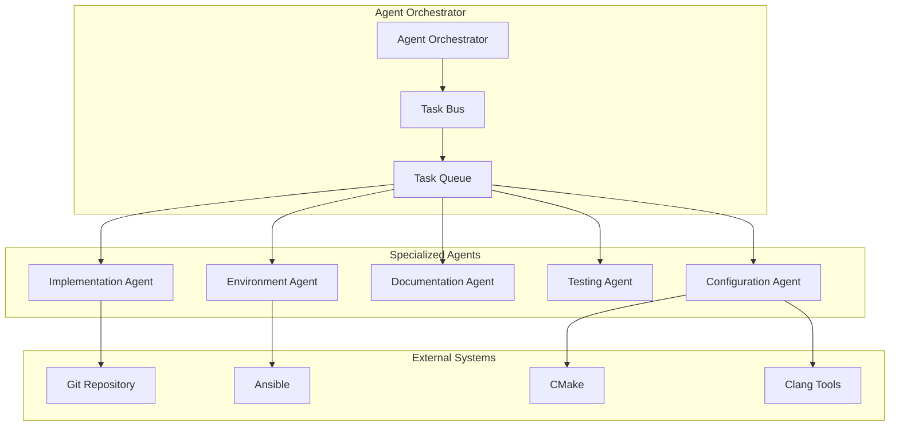
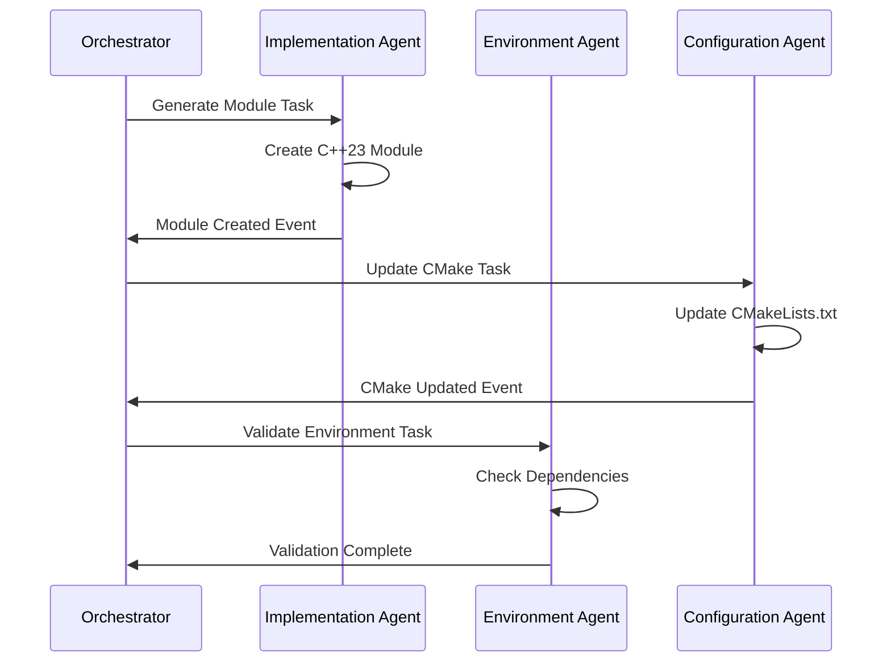

# FastestJSONInTheWest Multi-Agent Development System

## Overview

The FastestJSONInTheWest project utilizes a sophisticated multi-threaded agent system for automated development, testing, and deployment. This document describes the architecture, responsibilities, and coordination mechanisms of the agent system.

## Architecture

### Core Components



## Agent Specifications

### 1. Agent Orchestrator (Core System)

**File**: `agents/agent_orchestrator.py`

**Responsibilities**:
- Thread-safe task distribution and coordination
- Agent lifecycle management (start/stop/monitor)
- Inter-agent communication through event bus
- Task priority management and scheduling
- Status monitoring and reporting

**Key Features**:
- Asynchronous task execution with priority queues
- Thread-safe communication mechanisms
- Configurable timeout and retry policies
- Comprehensive logging and monitoring
- Event-driven architecture for loose coupling

**Task Types Handled**:
- Task routing and delegation
- Agent health monitoring
- System coordination and synchronization

### 2. Implementation Agent

**File**: `agents/implementation_agent.py`

**Responsibilities**:
- C++23 module generation with modern standards compliance
- Fluent API pattern implementation
- Smart pointer usage enforcement
- Concept and constraint generation
- ImGui simulator integration

**Key Features**:
- Template-driven code generation
- Module dependency management
- SIMD optimization code templates
- Lock-free data structure implementations
- Visual debugging component integration

**Generated Artifacts**:
- C++23 module files (`.cppm`)
- Fluent API class implementations
- Performance-optimized components
- ImGui visualization components
- Concept definitions and constraints

### 3. Environment Agent

**File**: `agents/environment_agent.py`

**Responsibilities**:
- Multi-platform Ansible playbook generation
- Development environment setup and validation
- Dependency management (Clang 21, OpenMPI, CMake, ZeroMQ)
- Platform-specific configuration handling
- Automated setup script creation

**Key Features**:
- Cross-platform compatibility (Ubuntu, CentOS, macOS)
- Automated dependency resolution
- Environment validation and health checks
- Source compilation when packages unavailable
- Configuration management and environment variables

**Generated Artifacts**:
- Comprehensive Ansible playbooks
- Platform-specific installation roles
- Automated setup scripts
- Environment validation tools
- Configuration management files

### 4. Documentation Agent

**File**: `agents/documentation_agent.py` (In Development)

**Responsibilities**:
- Automatic documentation updates when requirements change
- Sphinx documentation generation
- Architectural diagram updates using Mermaid
- API documentation synchronization
- Cross-reference maintenance

**Key Features**:
- Requirement change detection and propagation
- Multi-format documentation generation
- Automated diagram updates
- Version synchronization across documents
- Link validation and maintenance

### 5. Testing Agent

**File**: `agents/testing_agent.py` (In Development)

**Responsibilities**:
- Automated unit test generation using Google Test
- Regression test suite maintenance
- Memory leak detection with Valgrind integration
- Performance benchmarking
- Continuous integration support

**Key Features**:
- Code coverage analysis
- Test case generation from specifications
- Memory safety validation
- Performance regression detection
- Automated test maintenance

### 6. Configuration Agent

**File**: `agents/configuration_agent.py` (In Development)

**Responsibilities**:
- CMakeLists.txt maintenance and updates
- Clang-tidy configuration management
- Clang-format style enforcement
- Build system optimization
- Tool configuration synchronization

**Key Features**:
- Build configuration validation
- Dependency tracking and updates
- Style guide enforcement
- Optimization flag management
- Cross-platform build support

## Task Flow and Coordination

### Task Lifecycle

1. **Task Creation**: Tasks are created with specific types, priorities, and parameters
2. **Task Routing**: The orchestrator determines which agent should handle each task
3. **Task Assignment**: Tasks are assigned to appropriate agents via priority queues
4. **Task Execution**: Agents execute tasks asynchronously with progress reporting
5. **Result Collection**: Completed tasks return results to the orchestrator
6. **Event Propagation**: Success/failure events are broadcast to interested agents

### Inter-Agent Communication



## Usage Examples

### Basic Agent System Startup

```python
#!/usr/bin/env python3
import asyncio
from pathlib import Path
from agent_orchestrator import AgentOrchestrator, TaskType, TaskPriority
from implementation_agent import ImplementationAgent
from environment_agent import EnvironmentAgent

async def main():
    # Initialize orchestrator
    project_root = Path("/path/to/FastestJSONInTheWest")
    orchestrator = AgentOrchestrator(project_root)
    
    # Register agents
    orchestrator.register_agent(ImplementationAgent(orchestrator))
    orchestrator.register_agent(EnvironmentAgent(orchestrator))
    
    # Start all agents
    orchestrator.start_all_agents()
    
    # Submit environment setup task
    task = orchestrator.create_task(
        task_type=TaskType.ENVIRONMENT_SETUP,
        description="Generate Ansible playbook",
        parameters={
            "action": "generate_ansible_playbook",
            "platforms": ["ubuntu", "centos", "macos"]
        },
        priority=TaskPriority.HIGH
    )
    
    task_id = orchestrator.submit_task(task)
    
    # Monitor task completion
    # ... wait for completion logic
    
    orchestrator.stop_all_agents()

if __name__ == "__main__":
    asyncio.run(main())
```

### Environment Setup

```bash
# Execute the agent system to generate Ansible playbook
cd /path/to/FastestJSONInTheWest
python3 run_agents.py

# Deploy using generated Ansible playbook
cd ansible
./deploy.sh
```

### Manual Ansible Execution

```bash
# Local development setup
ansible-playbook -i hosts.ini comprehensive_setup.yml --limit local

# Remote development servers
ansible-playbook -i hosts.ini comprehensive_setup.yml --limit development_servers

# With specific tags
ansible-playbook -i hosts.ini comprehensive_setup.yml --tags "compiler,build"
```

## Configuration

### Agent Configuration File

**File**: `agent_config.yaml`

```yaml
project_name: FastestJSONInTheWest
cpp_standard: C++23
primary_compiler: clang++-21
build_system: cmake
test_framework: gtest

agents:
  implementation:
    enabled: true
    thread_count: 2
    queue_size: 100
  
  environment:
    enabled: true
    supported_platforms: [ubuntu, centos, macos]
    ansible_check_mode: false
  
  documentation:
    enabled: true
    sphinx_output: docs/_build
    auto_update: true
  
  testing:
    enabled: true
    coverage_threshold: 80
    valgrind_enabled: true
  
  configuration:
    enabled: true
    auto_format: true
    style_guide: google
```

### Environment Variables

```bash
# Agent system configuration
export FASTJSON_PROJECT_ROOT=/path/to/FastestJSONInTheWest
export FASTJSON_LOG_LEVEL=INFO
export FASTJSON_AGENT_TIMEOUT=300

# Ansible configuration
export ANSIBLE_HOST_KEY_CHECKING=False
export ANSIBLE_BECOME_PASS=your_sudo_password
```

## Monitoring and Logging

### Log Files

- `agent_system.log`: Main system log with all agent activities
- `agents/implementation.log`: Implementation agent specific logs
- `agents/environment.log`: Environment agent specific logs
- `ansible/ansible.log`: Ansible execution logs

### Status Monitoring

```python
# Get agent status
agent_status = orchestrator.get_agent_status()
print(f"Implementation Agent: {agent_status['ImplementationAgent']}")

# Get task history
for task in orchestrator.task_history:
    print(f"Task {task.task_id}: {task.status}")
```

## Error Handling and Recovery

### Common Issues and Solutions

1. **Agent Startup Failures**
   - Check Python dependencies
   - Verify project root path
   - Review agent configuration

2. **Ansible Execution Errors**
   - Validate inventory file
   - Check SSH connectivity
   - Verify sudo permissions

3. **Compilation Issues**
   - Ensure Clang 21 is properly installed
   - Check environment variables
   - Validate CMake configuration

### Troubleshooting Commands

```bash
# Check agent system health
python3 -c "from agents.agent_orchestrator import AgentOrchestrator; print('Agent system OK')"

# Validate Ansible playbook
ansible-playbook --syntax-check comprehensive_setup.yml

# Test local connectivity
ansible localhost -m ping -i hosts.ini

# Check environment setup
source /etc/profile.d/fastjson-dev.sh
clang++-21 --version
cmake --version
mpirun --version
```

## Future Enhancements

### Planned Features

1. **AI-Assisted Code Review Agent**
   - Automated code quality analysis
   - Security vulnerability detection
   - Performance optimization suggestions

2. **Continuous Integration Agent**
   - GitHub Actions integration
   - Automated testing pipelines
   - Deployment automation

3. **Performance Monitoring Agent**
   - Benchmark execution and tracking
   - Performance regression detection
   - Resource usage optimization

4. **Documentation Intelligence Agent**
   - Natural language documentation generation
   - Code-to-documentation synchronization
   - Interactive documentation updates

## Contributing to the Agent System

### Adding New Agents

1. Create new agent class inheriting from `Agent`
2. Implement `execute_task` method
3. Register agent with orchestrator
4. Update task routing logic
5. Add appropriate tests

### Extending Task Types

1. Add new task type to `TaskType` enum
2. Update agent routing logic
3. Implement task handling in appropriate agent
4. Update documentation

### Agent Development Guidelines

- Follow async/await patterns for non-blocking operations
- Use thread-safe data structures for shared state
- Implement proper error handling and logging
- Include comprehensive docstrings
- Add unit tests for new functionality

---

*Generated by the FastestJSONInTheWest Multi-Agent Development System*
*Last Updated: November 14, 2025*