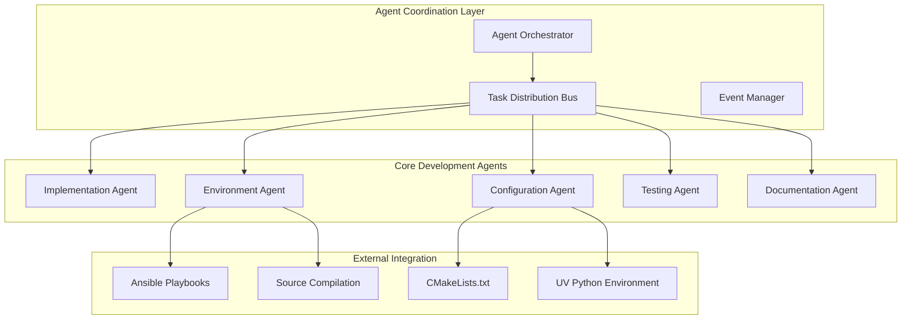

# FastestJSONInTheWest Multi-Agent Development System

## Overview

The FastestJSONInTheWest project utilizes a sophisticated multi-threaded agent system for automated development, testing, and deployment. This system acts as intelligent workhorses and development partners to implement the project according to coding standards and requirements.

> **Note**: The agent system is not technically part of the FastestJSONInTheWest JSON library itself. These agents are development automation tools that help implement, test, and maintain the actual library according to the specified requirements and coding standards.

## Architecture Philosophy

The agents operate as autonomous development assistants that:
- Read requirements from [`CLAUDE.md`](CLAUDE.md)
- Follow coding standards from [`coding_standards.md`](coding_standards.md)
- Generate source code, build configurations, and deployment scripts
- Maintain consistency across the entire development ecosystem
- Automatically adapt to requirement changes

## Agent System Structure



## Agent Specifications

### 1. Agent Orchestrator
**Location**: [`agents/agent_orchestrator.py`](../agents/agent_orchestrator.py)

**Purpose**: Central coordination system managing all agent activities

**Key Responsibilities**:
- Thread-safe task distribution and prioritization
- Agent lifecycle management and health monitoring
- Inter-agent communication through event bus
- Resource allocation and conflict resolution
- Comprehensive logging and status reporting

### 2. Implementation Agent
**Location**: [`agents/implementation_agent.py`](../agents/implementation_agent.py)

**Purpose**: Generates C++23 code following project coding standards

**Key Responsibilities**:
- C++23 module generation with smart pointers and concepts
- Fluent API pattern implementation
- SIMD-optimized code templates
- ImGui simulator integration code
- Lock-free data structure implementations

**Generated Artifacts**:
- C++23 module files (`.cppm`)
- Performance-optimized template implementations
- Visual debugging and simulation components
- Concept definitions and type constraints

### 3. Environment Agent
**Location**: [`agents/environment_agent.py`](../agents/environment_agent.py)

**Purpose**: Manages development environment setup and dependency compilation

**Enhanced Capabilities for Source Installation**:
- **Multi-platform Ansible playbooks** (Ubuntu, Debian, RedHat, CentOS, Fedora, Windows WSL)
- **Source compilation management** for Clang 21, OpenMPI, ZeroMQ, and all dependencies
- **Windows WinRM support** for remote Windows environment setup
- **UV Python environment** integration for isolated Python tooling
- **Dependency path management** for CMake integration

**Platform Support Matrix**:
| Platform | Package Manager | Source Compilation | Remote Management |
|----------|----------------|-------------------|-------------------|
| Ubuntu/Debian | APT (fallback) | ✅ Primary | SSH |
| RedHat/CentOS/Fedora | YUM/DNF (fallback) | ✅ Primary | SSH |
| Windows WSL | WSL Ubuntu | ✅ Primary | SSH/WinRM |
| Windows Native | Chocolatey (fallback) | ✅ Primary | WinRM |
| macOS | Homebrew (fallback) | ✅ Primary | SSH |

### 4. Configuration Agent
**Location**: [`agents/configuration_agent.py`](../agents/configuration_agent.py) *(Enhanced)*

**Purpose**: Automatically maintains build system configuration

**Enhanced Responsibilities**:
- **Dynamic CMakeLists.txt updates** when dependencies change
- **Source-built dependency path management**
- **Environment variable integration** for custom-built software
- **Library and header file location tracking**
- **Cross-platform build configuration**

**CMake Integration Features**:
- Automatic `find_package()` generation for source-built libraries
- Custom path configuration for non-standard installations
- Environment variable setup for compilation
- Dependency version tracking and validation

### 5. Testing Agent
**Location**: [`agents/testing_agent.py`](../agents/testing_agent.py) *(To be enhanced)*

**Purpose**: Automated testing infrastructure management

**Responsibilities**:
- Unit test generation using Google Test
- Valgrind memory leak detection integration
- Performance regression testing
- Cross-platform test execution

### 6. Documentation Agent
**Location**: [`agents/documentation_agent.py`](../agents/documentation_agent.py) *(To be enhanced)*

**Purpose**: Maintains project documentation consistency

**Responsibilities**:
- Automatic documentation updates when requirements change
- Sphinx documentation generation
- API documentation synchronization
- Cross-reference maintenance

## Enhanced Features for Source Compilation

### UV Python Environment Integration

The agents now use UV for Python dependency management:

```bash
# Initialize UV environment in project
uv init --python 3.11

# Add development dependencies
uv add ansible pyyaml jinja2 sphinx

# Run agents with UV
uv run python agents/run_agents.py
```

### Source Compilation Strategy

All software except CMake is compiled from source to ensure:
- **Consistent versions** across all platforms
- **Optimal performance** with native compilation flags
- **Custom patches** when needed for project requirements
- **Reproducible builds** independent of system packages

**Source Compilation Order**:
1. **LLVM/Clang 21** - Core compiler toolchain
2. **OpenMPI 5.0** - Parallel computing framework
3. **ZeroMQ 4.3.5** - High-performance messaging
4. **Google Test** - Testing framework
5. **ImGui + dependencies** - Visual debugging
6. **Additional libraries** as specified in requirements

### Windows Integration

**Windows WSL Support**:
- Native Ubuntu environment within WSL2
- Source compilation identical to Linux
- Seamless integration with Windows development tools

**Windows WinRM Support**:
- Remote PowerShell execution for Windows-specific tasks
- Chocolatey package manager integration (fallback)
- Visual Studio Build Tools integration
- Windows-specific path and registry management

### CMakeLists.txt Auto-Management

The Configuration Agent automatically maintains CMakeLists.txt with:

```cmake
# Automatically generated source-built dependency paths
set(LLVM_ROOT "/opt/fastjson/llvm-21")
set(OPENMPI_ROOT "/opt/fastjson/openmpi-5.0")
set(ZMQ_ROOT "/opt/fastjson/zeromq-4.3.5")

# Custom find modules for source-built libraries
list(APPEND CMAKE_MODULE_PATH "${CMAKE_SOURCE_DIR}/cmake/modules")

# Automatic dependency detection
find_package(LLVM REQUIRED CONFIG HINTS ${LLVM_ROOT})
find_package(MPI REQUIRED HINTS ${OPENMPI_ROOT})
find_package(ZeroMQ REQUIRED HINTS ${ZMQ_ROOT})

# Environment-specific compiler flags
if(FASTJSON_SOURCE_BUILT)
    set(CMAKE_C_COMPILER "${LLVM_ROOT}/bin/clang")
    set(CMAKE_CXX_COMPILER "${LLVM_ROOT}/bin/clang++")
    set(CMAKE_CXX_FLAGS "${CMAKE_CXX_FLAGS} -stdlib=libc++")
endif()
```

## Agent Execution Workflow

### 1. Environment Setup Phase
```bash
cd agents
uv run python run_agents.py
```

This triggers:
- Platform detection and validation
- Source dependency compilation planning
- Ansible playbook generation
- UV Python environment setup

### 2. Source Compilation Phase
```bash
cd ansible
./deploy.sh
```

This executes:
- Cross-platform source compilation
- Dependency installation and configuration
- Environment variable setup
- Validation and testing

### 3. Build System Integration
- CMakeLists.txt automatic updates
- Custom find module generation
- Environment variable integration
- Cross-platform build validation

## Timeline Estimate

### Immediate Tasks (1-2 hours)
- ✅ Project restructuring (files moved to correct locations)
- ✅ UV Python environment setup
- 🔄 Enhanced Environment Agent with source compilation
- 🔄 Configuration Agent for CMakeLists.txt management

### Short Term (3-6 hours)
- Enhanced Ansible playbooks with source compilation
- Windows WSL and WinRM integration
- CMake automatic dependency management
- Testing and validation of source builds

### Medium Term (1-2 days)
- Testing Agent implementation
- Documentation Agent enhancements
- Advanced dependency tracking
- Performance optimization integration

### Long Term (3-5 days)
- AI-assisted code review agent
- Continuous integration agent
- Advanced monitoring and optimization
- Complete automation pipeline

## Usage Examples

### Basic Agent System Execution
```bash
# Navigate to agents directory
cd agents

# Ensure UV environment is available
uv --version

# Run the agent system
uv run python run_agents.py

# Deploy generated environment
cd ../ansible
./deploy.sh
```

### Custom Dependency Addition
When adding a new dependency to [`CLAUDE.md`](CLAUDE.md):
1. Update requirements specification
2. Run agents: `uv run python agents/run_agents.py`
3. Agents automatically:
   - Update Ansible playbooks for source compilation
   - Modify CMakeLists.txt with new dependency paths
   - Generate appropriate find modules
   - Update environment configurations

### Windows Development
```bash
# For WSL environment
wsl --install Ubuntu
cd /mnt/c/path/to/FastestJSONInTheWest
uv run python agents/run_agents.py

# For Windows remote management
# Configure WinRM on target Windows machines
ansible-playbook -i windows_hosts.ini windows_setup.yml
```

## Agent Development Guidelines

### Adding New Dependencies
1. Update [`CLAUDE.md`](CLAUDE.md) with new requirements
2. Agents automatically detect changes
3. Environment Agent generates source compilation steps
4. Configuration Agent updates build system
5. Testing Agent validates integration

### Extending Platform Support
1. Add platform detection in Environment Agent
2. Create platform-specific Ansible roles
3. Update CMake platform detection
4. Test cross-platform builds

### Customizing Build Flags
Agents automatically handle:
- Architecture-specific optimizations (-march=native)
- Debug vs Release configurations
- Sanitizer integration
- Performance profiling flags

---

*This agent system represents a comprehensive automation framework for modern C++ development, ensuring consistency, performance, and maintainability across all aspects of the FastestJSONInTheWest project.*